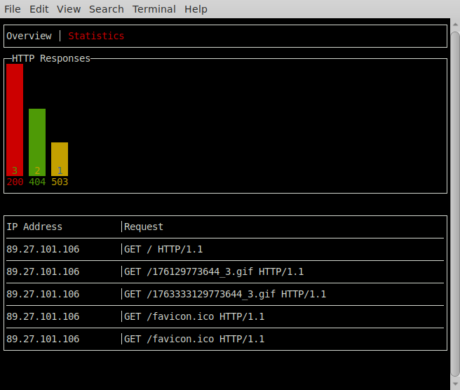
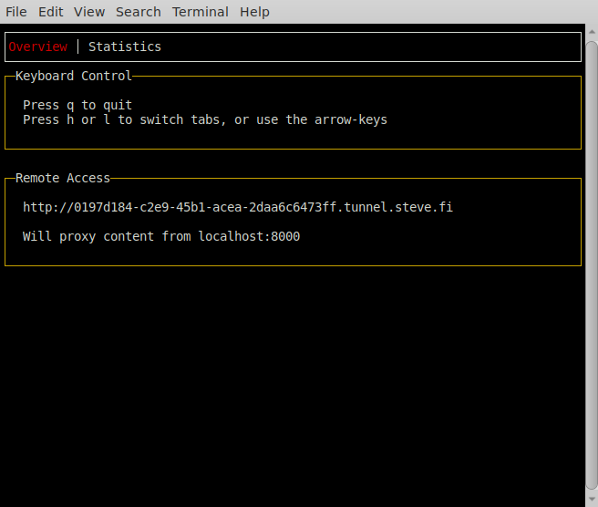

Table of Contents
=================

* [tunneller](#tunneller)
* [Overview](#overview)
* [How it works](#how-it-works)
* [Installation](#installation)
  * [Source Installation go &lt;=  1.11](#source-installation-go---111)
  * [Source installation go  &gt;= 1.12](#source-installation-go---112)
  * [Installation of your self-hosted Server](#installation-of-your-self-hosted-server)
* [Github Setup](#github-setup)

# tunneller

Tunneller allows you to expose services which are running on `localhost`, or on your local network, to the public internet.

This is very useful for testing webhooks, the generation of static-site compilers, and similar things.

>**NOTE**: There is a public end-point I host, you __SHOULD NOT__ rely upon it.  It might come and go.  It is not secure.

There is a _basic_ GUI present to allow you to view status-codes, and the most recent few requests:

## Overview

Assuming you have a service running within your local network, perhaps a HTTP server you could access via http://localhost:8080/, you can expose that to the public-internet by running:

    $ tunneller client -expose localhost:8080

This will show you initial page of the GUI, letting you know how you can access your resource externally:

As the name implies there is a central-host involved which is in charge of routing/proxying to your local network - in this case that central host is `tunnel.steve.fi` - the reason this project exists is not to host a general-purpose end-point, but instead to allow you to host your own.

In short this project is designed to be a __self-hosted__ alternative to software such as `ngrok`.

So remember:

>**NOTE**: There is a public end-point I host, you __SHOULD NOT__ rely upon it.  You should configure your own server, and use it.

## How it works

When a client is launched it creates a connection to a message-bus running on the default remote end-point, `tunnel.steve.fi`, it keeps that connection alive waiting for instructions.

When a request comes in for `foo.tunnel.steve.fi` the server will submit a command for the client to make the appropriate request by publishing a message upon the topic the client is listening to.  (Each client has a name, and listens to its own topic).

In short:

* The server sends a "Fetch this URL" request to the client.
* The client makes the request to fetch the URL
  * This will succeed, because the client is running inside your network and can access localhost, and any other "internal" resources.
* The response is sent back to the server.
  * And from there it is routed back to the requested web-browser.

Because the client connects directly to a message-bus there is always the risk that malicious actors will inject fake requests, attempting to scan, probe, and otherwise abuse your local network.

## Installation

There are two ways to install this project from source, which depend on the version of the [go](https://golang.org/) version you're using.

> **NOTE**: If you prefer you can find binary releases upon our [release page](https://github.com/skx/tunneller/releases/)

### Source Installation go <=  1.11

If you're using `go` before 1.11 then the following command should fetch/update `tunneller`, and install it upon your system:

     $ go get -u github.com/skx/tunneller

### Source installation go  >= 1.12

If you're using a more recent version of `go` (which is _highly_ recommended), you need to clone to a directory which is not present upon your `GOPATH`:

    git clone https://github.com/skx/tunneller
    cd tunneller
    go install

If you don't have a golang environment setup you should be able to download a binary for GNU/Linux from [our release page](https://github.com/skx/tunneller/releases).

## Installation of your self-hosted Server

If you wish to host your own central-server this is how to do it:

* Create a DNS-entry `tunnel.example.com`, pointing to your host.
* Create a __wildcard__ DNS entry for `*.tunnel.example.com` to point to the same host.
* Setup and configure [mosquitto queue](https://mosquitto.org/) running on that same host.
  * See [mq/](mq/) for details there.
  * Don't forget to ensure that the MQ-service is publicly visible, by opening a firewall hole for port `1883` if required.

Of course security is important, so you should ensure that your message-bus is only reachable by clients you trust to expose their services.  (i.e. Your VPN and office range(s).)

## Github Setup

This repository is configured to run tests upon every commit, and when
pull-requests are created/updated.  The testing is carried out via
[.github/run-tests.sh](.github/run-tests.sh) which is used by the
[github-action-tester](https://github.com/skx/github-action-tester) action.

Releases are automated in a similar fashion via [.github/build](.github/build),
and the [github-action-publish-binaries](https://github.com/skx/github-action-publish-binaries) action.
